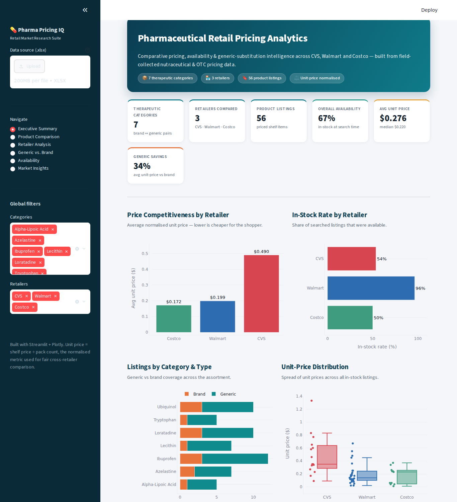
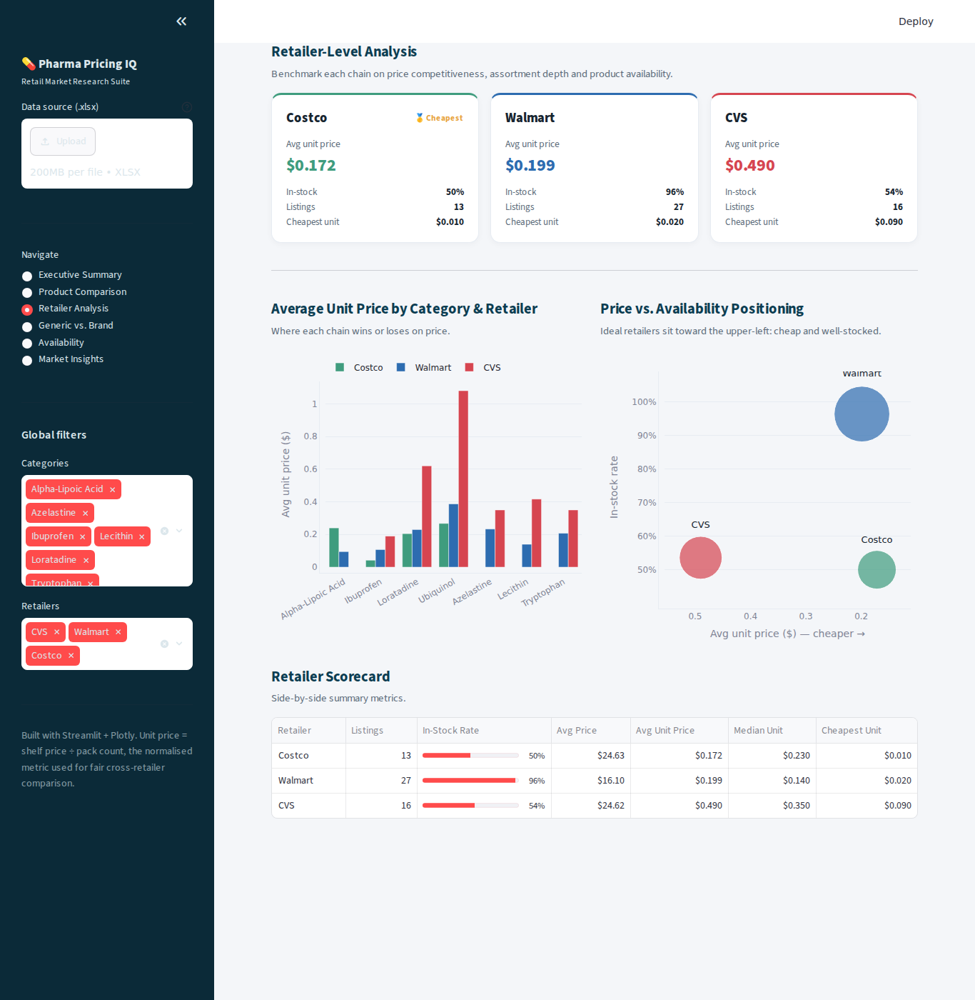

# 💊 Pharmaceutical Retail Pricing Analytics

An interactive **market-research dashboard** that transforms a raw retail
pricing spreadsheet into an executive-grade business-intelligence platform.
It compares pharmaceutical and nutraceutical pricing across **CVS, Walmart,
and Costco**, surfacing retailer pricing strategies, generic-substitution
opportunities, and product-availability trends.

Built with **Streamlit** and **Plotly**.

<p align="center">
  
</p>

---

## Table of Contents
- [Overview](#overview)
- [Features](#features)
- [Screenshots](#screenshots)
- [Quick Start](#quick-start)
- [Project Structure](#project-structure)
- [The Dataset](#the-dataset)
- [Methodology](#methodology)
- [Key Findings](#key-findings)
- [Tech Stack](#tech-stack)
- [Limitations & Future Work](#limitations--future-work)

---

## Overview

Retail prices for over-the-counter drugs and dietary supplements vary widely
across chains, pack sizes, and brand-vs-generic formulations. Comparing them
fairly is hard because a "$20 bottle" means nothing without knowing how many
units are inside.

This project ingests a field-collected pricing workbook and rebuilds it into a
clean analytical model, then presents six analytical lenses through a polished,
filterable web app. The central comparison metric throughout is the
**normalised unit price** (shelf price ÷ pack count), which makes a 60-count
bottle and a 1,000-count bottle directly comparable.

**Primary objective:** help a researcher or category manager answer three
questions quickly —

1. *Which retailer is genuinely cheapest, and for what?*
2. *Where does switching to a generic actually save money?*
3. *What can shoppers reliably find in stock, and what is hard to source?*

---

## Features

| Module | What it answers |
| ------ | --------------- |
| **Executive Summary** | Headline KPIs (categories, retailers, availability, average unit price, generic savings) plus retailer price/availability overviews and an auto-written takeaway. |
| **Product Comparison** | Drill into any therapeutic category and compare every listing side-by-side: unit price by product, price-vs-pack-size economics, and a full detail table. |
| **Retailer Analysis** | Per-chain scorecards, an average-unit-price-by-category matrix, and a price-vs-availability positioning map. |
| **Generic vs. Brand** | Quantifies the substitution opportunity per category, ranks savings, and flags counter-intuitive cases where the brand is actually cheaper. |
| **Availability** | A category × retailer in-stock heatmap, availability by retailer and category, and an explicit stock-gap table. |
| **Market Insights** | Narrative findings generated *directly from the data*, a best-value pick per category, and synthesised research conclusions. |

Additional capabilities:

- 🎛️ **Global filters** — slice the entire dashboard by category and retailer.
- 📤 **Bring your own data** — upload any workbook with the same layout.
- 📊 **Interactive charts** — hover, zoom, and inspect every Plotly figure.
- 🧮 **Robust data engine** — reconstructs Excel merged-cell hierarchies and
  handles missing/Rx-only listings gracefully.

---

## Screenshots

**Retailer-level analysis** — scorecards, category price matrix, and a
price-vs-availability positioning map:

<p align="center">
  
</p>

---

## Quick Start

### 1. Clone the repository
```bash
git clone https://github.com/<your-username>/pharma-retail-pricing-analytics.git
cd pharma-retail-pricing-analytics
```

### 2. Create a virtual environment (recommended)
```bash
python -m venv .venv
source .venv/bin/activate        # Windows: .venv\Scripts\activate
```

### 3. Install dependencies
```bash
pip install -r requirements.txt
```

### 4. Run the app
```bash
streamlit run app.py
```

Streamlit will open the dashboard in your browser at
**http://localhost:8501**. The bundled dataset loads automatically — no
configuration required.

> **Python 3.9+** is recommended.

---

## Project Structure

```
pharma-retail-pricing-analytics/
├── app.py                  # Streamlit application (UI, charts, layout, insights)
├── data_processing.py      # Data loading, cleaning & analytics functions
├── requirements.txt        # Python dependencies
├── README.md               # This file
├── .gitignore
├── .streamlit/
│   └── config.toml         # Theme + server configuration
├── assets/                 # Screenshots used in the README
│   ├── dashboard_executive.png
│   └── dashboard_retailer.png
└── data/
    └── Pharmaceutical_Retail_Pricing_Analytics.xlsx   # Source dataset
```

The code is intentionally split so the **analytics layer**
(`data_processing.py`) is independent of the **presentation layer** (`app.py`)
— the cleaning and metric functions can be imported and unit-tested on their
own.

---

## The Dataset

The source workbook contains field-collected retail pricing for seven
therapeutic categories, each represented by a brand and its generic compound,
searched across all three retailers.

**Data dictionary**

| Field | Description |
| ----- | ----------- |
| `Brand Name` | Reference branded product for the category (e.g. *Advil*). |
| `Generic Name` | Generic compound / therapeutic category (e.g. *Ibuprofen*). |
| `Retailer` | CVS Pharmacy, Walmart, or Costco Wholesale. |
| `Product Name` | The specific listing found on the retailer's shelf/site. |
| `Search Type` | Whether the listing was found under a `Generic` or `Brand` search. |
| `Price ($)` | Observed shelf price. |
| `Count` | Number of units (tablets, softgels, mL, etc.) in the pack. |
| `Strength` | Dose per unit (mixed units across categories). |
| `Price/Count ($)` | **Unit price** — the normalised comparison metric. |
| `Availability` | `YES` if the item was in stock at search time, else `NO`. |

> The raw file uses an Excel "merged-cell" layout where `Brand Name`,
> `Generic Name`, and `Retailer` are written only on the first row of each
> block. `data_processing.py` reconstructs a fully-populated tidy table from
> this layout.

---

## Methodology

1. **Parsing** — the real header sits on the second row; spacer columns
   between the merged-cell fields are dropped.
2. **Hierarchy reconstruction** — `Brand Name`, `Generic Name`, and `Retailer`
   are forward-filled; `Search Type` is forward-filled *within* each retailer
   block (a block runs `Generic` until a `Brand` row appears).
3. **Cleaning** — textual `"N/A"` placeholders become true missing values;
   price, count, and unit-price columns are coerced to numeric.
4. **Availability vs. price subsets** — availability metrics use every searched
   listing, while price math uses only listings that are *both in stock and
   priced* (some in-stock prescription-only items carry no shelf price and are
   excluded from price averages but still counted for availability).
5. **Normalisation** — all cross-retailer price comparisons use
   `Price/Count`, never raw shelf price, to remove pack-size distortion.
6. **Insight generation** — narrative findings are computed live from the
   filtered dataframe (price leaders, largest generic savings, inverted cases,
   availability laggards, and pack-size/unit-price correlation).

---

## Key Findings

*(from the bundled dataset; figures update live with the dashboard filters)*

- **Costco is the unit-price leader** (~$0.17 average unit price), driven by
  bulk pack sizes and private-label lines — roughly **65% cheaper** per unit
  than CVS (~$0.49).
- **Walmart wins on availability**, with ~**96%** of searched listings in
  stock versus ~50–54% at Costco and CVS, making it the strongest one-stop
  source.
- **Generics are ~34% cheaper per unit on average**, but the rule is *not*
  universal — for a few categories (e.g. *Lecithin*) the branded product ships
  in larger packs and wins on unit price. **Unit-price comparison beats brand
  status** as a purchasing heuristic.
- **Mainstream OTC drugs** (ibuprofen, loratadine) are universally stocked,
  while **niche supplements** show real availability gaps — an opening for
  specialty and online channels.
- **Bulk economics reward the informed shopper:** pack size and unit price are
  negatively correlated; warehouse-format listings anchor the best-value tier
  across nearly every category.

---

## Tech Stack

- **[Streamlit](https://streamlit.io/)** — application framework & UI
- **[Plotly](https://plotly.com/python/)** — interactive charts
- **[pandas](https://pandas.pydata.org/)** — data wrangling
- **[openpyxl](https://openpyxl.readthedocs.io/)** — Excel parsing
- **[NumPy](https://numpy.org/)** — numerical helpers
- Custom CSS for the business-intelligence visual design

---

## Limitations & Future Work

- **Snapshot data** — prices and availability reflect a single collection
  window; a time dimension would enable trend analysis.
- **Strength normalisation** — `Strength` mixes units (mg, mcg, mL, %),
  so it is shown descriptively rather than used in price-per-dose math.
  Parsing it into a common basis is a natural extension.
- **Sample size** — seven categories across three retailers; broadening the
  basket would strengthen the generalisability of the insights.
- **Possible additions** — price-per-active-dose analysis, geographic price
  variation, and exportable PDF research briefs.

---

<p align="center"><sub>
Built as a market-research analytics project · Streamlit + Plotly ·
Unit-price-normalised comparison methodology
</sub></p>
